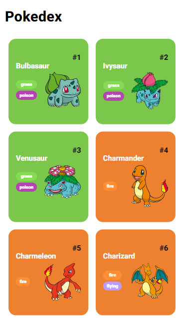

# Pokedex

Este projeto é uma Pokedex interativa desenvolvida em JavaScript que utiliza a [PokeAPI](https://pokeapi.co/) para exibir informações sobre os primeiros 151 Pokémon da 1° geração.

## 📋 Visão Geral

A aplicação carrega informações dos Pokémon e as exibe em cards estilizados. Cada card mostra o nome, número, tipos e uma imagem do Pokémon correspondente. O layout é responsivo, e o botão de carregamento permite visualizar mais Pokémon progressivamente.

### 🖼️ Interface

A interface exibe Pokémon com os seguintes detalhes:
- Nome
- Número na Pokedex
- Tipos
- Sprite (imagem do Pokémon)

Veja um exemplo da interface finalizada:



## 🚀 Tecnologias Utilizadas

- **HTML** e **CSS**: Para estruturar e estilizar os elementos da aplicação.
- **JavaScript**: Para realizar chamadas à API, manipular o DOM e implementar o botão de carregamento dinâmico.
- **PokeAPI**: Para obter dados sobre os Pokémon.

## 🛠️ Funcionalidades

- Exibição de Pokémon com detalhes como nome, número, tipos e imagem.
- Carregamento dinâmico de Pokémon ao clicar no botão "Carregar mais".
- Limitação no carregamento para exibir apenas os primeiros 151 Pokémon da geração original.

## 📦 Instalação

1. Clone este repositório:
   ```bash
   git clone https://github.com/Moraniel/pokedex.git


## 🚀 Sobre mim
Eu sou uma pessoa desenvolvedora full-stack...

"Graduando em Ciência da Computação pela Universidade Federal de Alagoas, com grande interesse por tecnologia e desenvolvimento de jogos. Atualmente, estou aprofundando meus conhecimentos em Java, com ênfase no framework Spring, buscando sempre aprimorar minhas habilidades e expandir meu aprendizado na área."
## 🔗 Links
[](https://www.dio.me/users/moraniel)
[](https://www.linkedin.com/in/moraniel/)
[](mailto:moraniel@outlook.com)
[](https://github.com/Moraniel)


